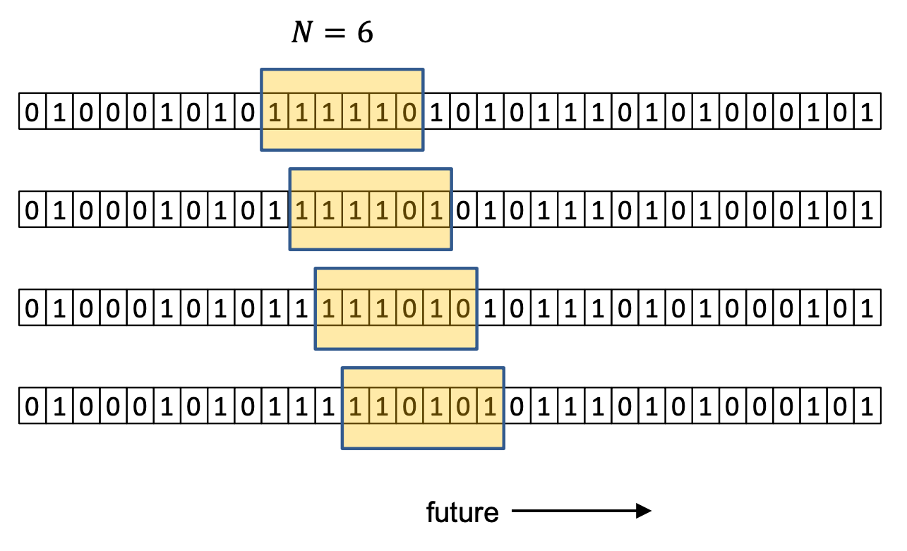

## Goal

The goal is to study the problem of maintaining a (1+𝜀)-factor approximation of the diameter ∆(𝑃) of a stream of points under the sliding window model.

## Sliding window model

* Under the sliding window model, only N points are stored at a time
* Points older than N are removed, new points are inserted
* The sliding window changes over time

## q.py

A didactic implementation of the one-dimensional algorithm that computes the approximate diameter storing O(log1+αR) points. Further explanations are available in our slides `geometricOpt.pdf` or in the original paper `paper.pdf`.

